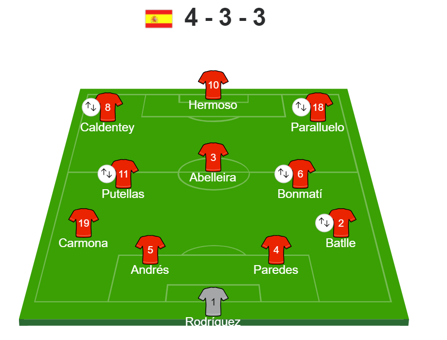
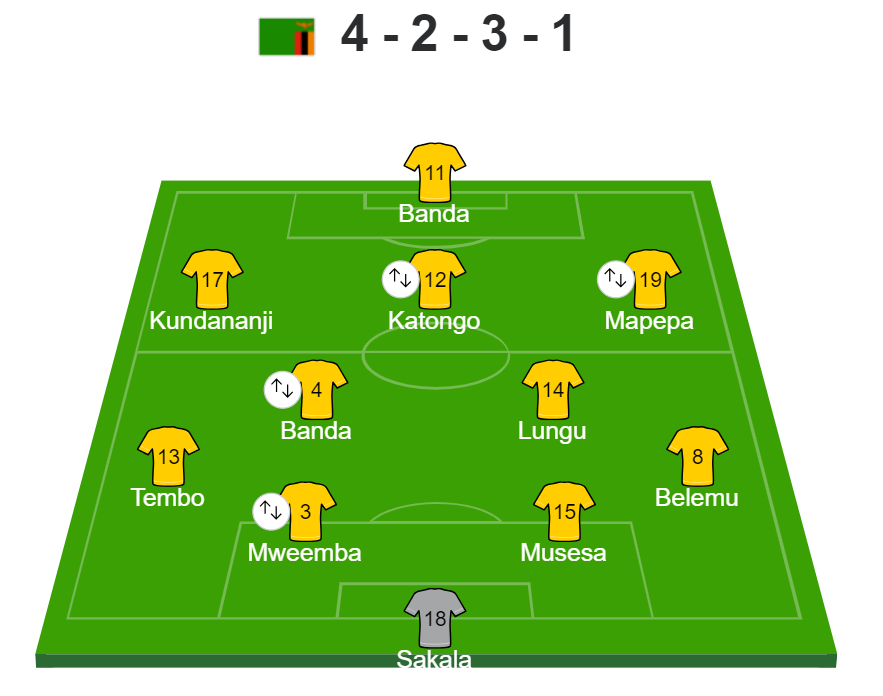
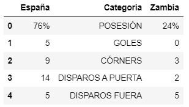
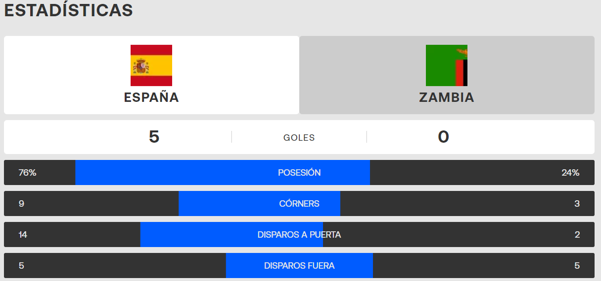
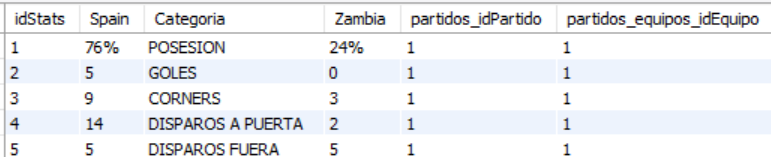
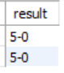

# ETL Project: Fifa Women's World Cup: Spain vs. Zambia

## Primer metodo: Scraping
### Primera fuente: Relevo Deportes: 
https://www.relevo.com/futbol/mundial-femenino/2022/directos/2023-07-26-2260585-espana-zambia-sd-di.html?tab=alineaciones

Para la primera fuente de información escogí la pagina de periodismo deportivo 'Relevo'. De aqui saqué las plantillas de cada equipo.
La alineación de España es la siguiente:

Y la Zambia la siguiente: 

### Segunda fuente: Eurosports: 
https://www.eurosport.es/futbol/mundial-femenino/2023/live-espana-zambia_mtc1402985/live.shtml
De la segunda fuente pude sacar la información estadistica del partido para crear tablas como la siguiente: 

Los datos en la pagina web se ven de la siguiente manera: 

Para verlos bien y obtener la tabla deseada tuve que scrapear los datos, separarlos en distintas columnas al estar todas las filas metidas como dato unico, limpiar los datos, reordenarlos y guardar la tabla en un csv.

## Segundo metodo: CSV de Kaggle
### Tercera fuente: Dataset de Kaggle:
https://www.kaggle.com/datasets/dyokelson/womens-world-cup-2019-results

El dataset de Kaggle incluia la historia de todos los partidos disputados desde 1969 hasta hoy en dia, sin incluir los de esta copa del mundo. Decidí comparar este resultado con posibles anteriores resultados de partidos disputados entre los dos equipos. Para ello, me descargué el dataset, examiné el dataset y al ver la cantidad de datos que había decidí crear varios dataframes con distinas condiciones como aislar los partidos en los que solo jugaban España o Zambia, los resultados de estos fueron los siguientes tablas (¡vacías!):

Los resultados de esto han dejado ver que este era el primer partido de competición oficial de la historia del futbol entre España y Zambia.

## Hacer la Base de Datos:
Tras tener toda la información y haberla importado a documentos csv para archivarla, procedí a crear la base de datos en sql con la siguiente estructura para despues insertar los datos y acabar el proyecto:

Para comprobar la funcionalidad de la base de datos creada realicé dos consultas:
1. Estadisticas del partido de España vs Zambia
select * from stats_spain_vs_zambia where partidos_equipos_idEquipo = 1;

2. Resultado partido de España - Zambia:
select result from partidos where equipos_idEquipo in (1,2);

